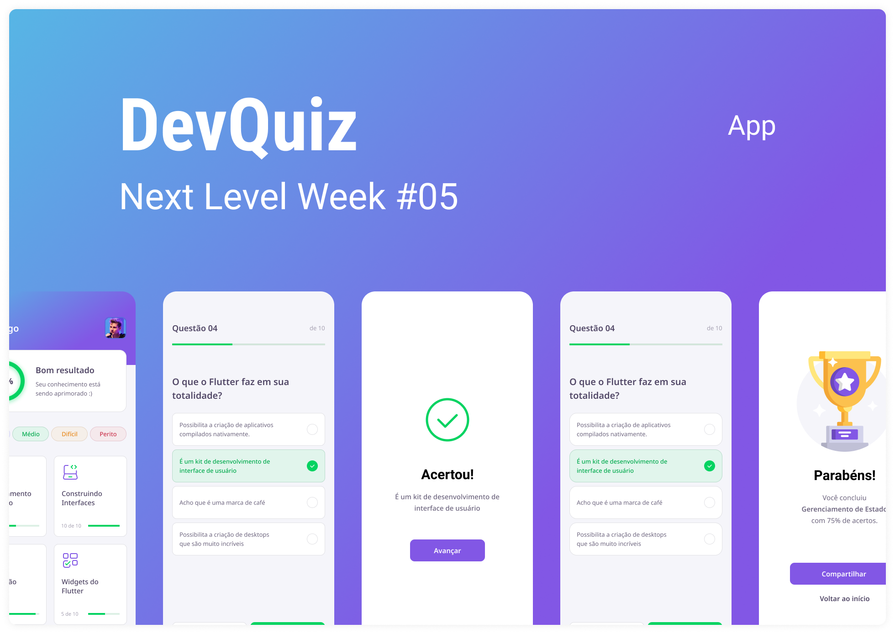

<p align="center">
  
</p>

<h2>Layout 🗺️</h2>

The layout was developed by [Tiago Luchtenberg](https://www.instagram.com/tiagoluchtenberg/), and you can access it on Figma: 
[Layout](https://www.figma.com/file/fMqKhwT9L5D3MVe4btRtG5)

<h2>Tecnologies ✨</h2> 

This project was developed with the following technologies:

- [Flutter](https://flutter.dev/)
- [Dart](https://dart.dev/)
- [Firebase](https://firebase.google.com/)

<h2>Project 💻</h2>

Quizz application developed to test your knowledge in Flutter. I'm using:

- Clean Architecture;
- Unitary Tests;
- GetIt for dependency injection;
- BLoC for state management, dependency,
- Firebase for BaaS;

<h2> Features implemented 🔥 </h2>

- Login with Google;
- Internationalization (PT-BR, EN-US, ES-ES);
- Shimmer effects on loads;

<h2> How to run? 🚀</h2>

- Clone the repository;
- Enter the project folder;
- Run `flutter pub get` to install all project dependencies/packages;
- Launch a mobile device emulator or connect your smartphone to the computer <br>
  `(make sure your device has USB Debugging enabled)`;
- Run `flutter run` to run the app on your connected (or emulated) device;

<h2>How to Contribute 💪</h2>

   ```
   - Fork the project 

   - Create a new branch with your changes:
   $ git checkout -b my-feature

   - Save your changes and create a commit message telling you what you did:
   $ git commit -m "feature: My new feature"

   - Submit your changes:
   $ git push origin my-feature
   ```
